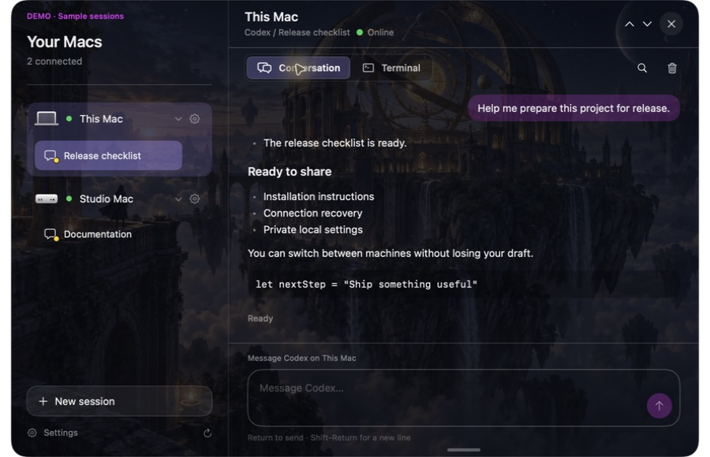

# herdrorb

A native macOS companion for [Herdr](https://github.com/herdrdev/herdr). Keep
Codex and Claude Code sessions across your Macs one click away, in a floating
orb and compact menu-bar panel.



Read formatted conversations, keep drafts when switching sessions, and open the
actual terminal for approvals, slash commands, and sign-in. Closing herdrorb
leaves your Herdr sessions running.

**Independent community project. Not affiliated with or endorsed by Herdr,
OpenAI, or Anthropic.**

## Requirements

- macOS 14 or later. Choose the build for your Mac: `arm64` (Apple Silicon) or
  `x86_64` (Intel). See the [compatibility and validation table](docs/COMPATIBILITY.md).
- Herdr **0.9.1, protocol 22**, installed and running on each target Mac.
- Codex and/or Claude Code installed and authenticated on the Macs where they run.
- For remote Macs: a saved Herdr machine profile and working noninteractive SSH.

## Install and connect

[Releases](https://github.com/andrewjedi/herdrorb/releases) provide source and
architecture-specific developer-beta archives. **The initial beta is ad-hoc
signed, not Developer ID signed or notarized.** macOS may block downloaded
archives. Building from source is the recommended installation path until a
notarized release is available; do not disable Gatekeeper system-wide.

1. [Install Herdr](https://github.com/herdrdev/herdr#install), using a version
   compatible with the table above, then run `herdr` in Terminal.
2. Build herdrorb below, or extract the appropriate release archive. Move
   `herdrorb.app` into Applications.
3. Open herdrorb. Setup detects a missing installation, stopped server, or
   unsupported protocol. Use **Locate Herdr…** for a custom executable, or
   **Check again** after installing or starting Herdr.
4. Choose **Continue**, then select an existing agent or **New session**.
   Agent accounts and sign-in are managed by their CLIs, not by herdrorb.

Press **⌘⇧D** to toggle the panel from any app. Change the shortcut in Settings → Orb → Toggle panel. The borderless panel unfurls from the floating orb with flowing galaxy light; closing draws it back in. Settings also includes a separate switch for its opening and closing sound. Reduce Motion replaces the expansion with a short fade.

The hexagonal menu-bar icon opens the panel even when the orb is hidden. Click
the orb to open it, drag to reposition it, or right-click the menu-bar icon to
hide/show the orb or quit. Settings controls appearance, sound, scrolling,
connection setup, and local data.

## Build from source

Install Xcode or its command-line tools with a Swift **6.0 or newer** toolchain.
The exact toolchains exercised by CI and local testing are documented in
[COMPATIBILITY.md](docs/COMPATIBILITY.md).

```sh
git clone https://github.com/andrewjedi/herdrorb.git
cd herdrorb
sh build-app.sh
open dist/herdrorb.app
```

Swift Package Manager resolves the pinned dependencies in `Package.resolved`.
The build bundles resources and license notices and uses a local ad-hoc
signature. No Apple developer account or signing credentials are needed for
this build. It doesn't install or start Herdr or any agent.

## Try the interface without Herdr

```sh
open -n dist/herdrorb.app --args --demo
```

Demo mode uses fictional in-memory sessions and separate preferences. It never
discovers your machines, connects over SSH, or starts agent processes. Terminal
attachment and real session creation are unavailable. `--setup-preview` shows
the missing-Herdr setup state without touching your installations.

## Everyday use

- In a Codex conversation, ask for an image or a follow-up edit in plain language.
  The connected CLI uses its native image-generation tool and returns a saved
  image for inline display. Click the image for a large Quick Look preview, use
  **Full Screen** or **Open in Preview**, and press Escape or Space to close it.
  This requires native image generation to be available in that CLI session;
  herdrorb does not add a separate API key or silently use a paid fallback.
- Return sends; Shift-Return inserts a newline. Drafts and reading positions are
  retained per session.
- In Codex and Claude Code conversations, the composer has permissions, model, reasoning-effort,
  and a lightning-bolt toggle for Fast mode. Choices come from the connected CLI and become
  active only after the CLI confirms them. The detected agent gets its own models and permission modes. Change settings while it is idle;
  unsupported or unfamiliar menus can still be handled in Terminal.
- Ultra is a Codex reasoning effort, separate from Fast speed. Claude uses its own
  effort levels and permission modes; bypass permissions must be enabled when the
  Claude session starts. Fast is unavailable when the CLI reports account or
  organization restrictions. Model choices apply to the current session.
- Click the microphone to dictate into your draft, then stop and review before
  sending. macOS requests Microphone and Speech Recognition permission the first
  time. Dictation stops when you close the panel or switch conversations.
- Type `/` to use the installed agent's command menu in **Terminal**. Use that
  view for approvals, interactive menus, and sign-in.
- A device's gear opens connection diagnostics, a custom Herdr path, an agent
  executable check, and project-folder settings.
- If agent startup fails, open its existing terminal to inspect the problem,
  then explicitly retry in that terminal.
- **Delete session** closes the actual terminal and running command; it asks
  for confirmation. Quitting the app only detaches its own clients.

## Privacy and limitations

Conversation view reconstructs terminal output. It is not a guaranteed complete
structured agent history, and it doesn't reproduce Codex desktop's edit/Undo
cards. Terminal is the authoritative interactive view. Approvals stay with the
underlying agents; uncertain prompt sends are never automatically retried.

Long conversations initially show the latest 40 messages. **Show earlier messages**
loads more while preserving your reading position, and search includes the retained
history. Scrolling upward pauses automatic following; returning to the bottom resumes it.

Conversation text and drafts are saved locally by default, with private file
permissions and bounded retention, without application-level encryption.
Image paths printed by agents can load automatically, including over SSH.
Both behaviors have settings. Read [Privacy and uninstall](docs/PRIVACY.md).

herdrorb has no analytics uploader or account service. Agent CLIs and Herdr
have their own network behavior. Diagnostics copied from Settings omit names,
paths, SSH targets, conversation text, and raw error messages.

## Contribute and get help

```sh
swift test
sh scripts/check.sh
```

See [CONTRIBUTING.md](CONTRIBUTING.md), the [architecture](docs/ARCHITECTURE.md),
[troubleshooting](docs/TROUBLESHOOTING.md), [roadmap](ROADMAP.md), and
[changelog](CHANGELOG.md). Report ordinary bugs through
[Issues](https://github.com/andrewjedi/herdrorb/issues); report vulnerabilities
privately as described in [SECURITY.md](SECURITY.md).

## License

[MIT](LICENSE), copyright © 2026 Andrew Thompson. Bundled dependency notices
are in [THIRD_PARTY_NOTICES.md](THIRD_PARTY_NOTICES.md). Herdr remains a
separately installed project under its own license.
