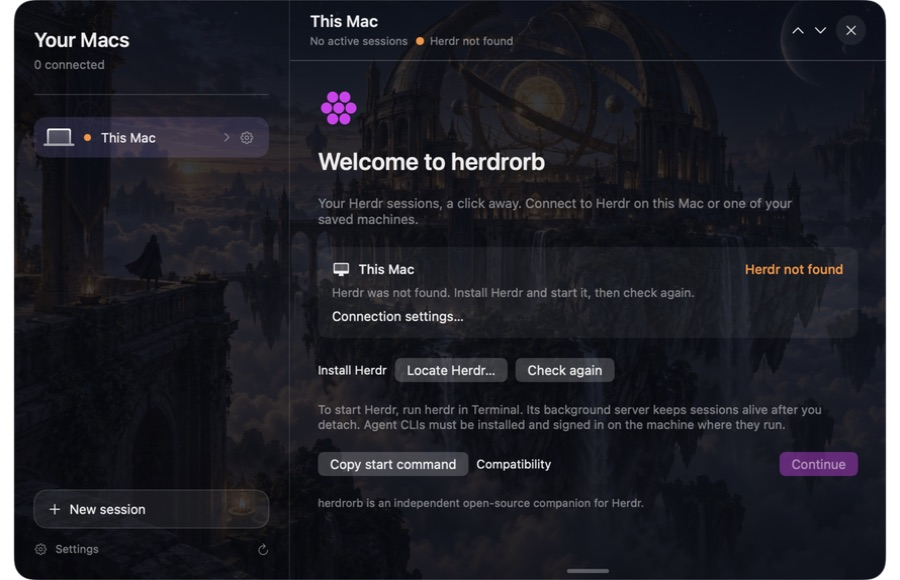

# Troubleshooting

## Herdr is not found

Install a compatible version from the official Herdr project. herdrorb searches
Homebrew, ~/.local/bin, ~/.cargo/bin, mise shims and the app's inherited PATH.
Finder does not necessarily inherit your interactive shell's PATH. Use Locate
Herdr or an absolute executable override in the device's connection settings.
A broken explicit override is reported rather than silently using another binary.

## Installed, but stopped

Run `herdr` in Terminal on that device. Leave its background server running;
a visible Herdr client window is not required. Click Check again. A missing or
stopped local server does not prevent independently working remote machines
from remaining usable.

## Incompatible version

Read docs/COMPATIBILITY.md and compare the reported protocol. Use the Herdr
version supported by your herdrorb release. No automatic installation,
downgrade, or process restart is performed.

## SSH authentication, unreachable host, or changed host key

Use your saved profile's SSH target in Terminal and establish a normal verified
connection first. Check network access, ~/.ssh/config, agent/key availability,
and any jump-host setup. herdrorb uses BatchMode, so it cannot ask for an SSH
password or key passphrase inside the connection worker. Never disable host-key
verification; investigate a changed host key through a trusted channel.

Device settings exposes Test connection, custom remote Herdr executable paths,
and sanitized diagnostics even when the machine has no sessions. Configure
remote machines through Herdr's documented machine-management workflow.

## Codex or Claude cannot start

Install and authenticate the chosen CLI on the target Mac. Check installed
agents in the new-session view. This detects executables, not account status;
Herdr's existing server can also have a different PATH from a newly opened shell.
A failed launch keeps recovery controls for its underlying terminal during the
current app run. Open terminal, inspect or complete sign-in, then explicitly
retry in that same terminal. After restarting herdrorb, the underlying terminal
remains accessible in Herdr. Never blindly resend a prompt after a timeout.

## Conversation differs from the terminal

Conversation view is reconstructed from terminal output, with bounded retained
history. Open Terminal for the authoritative interactive view and approvals.
Report a minimal, sanitized output fixture and exact CLI version for parser bugs.

## App is blocked on first download

Initial developer-beta binaries are not notarized. Building from the public
source is recommended until a Developer ID signed/notarized release is available.
Do not disable Gatekeeper globally or run arbitrary cleanup commands from issues.

## Reporting a bug

Include reproduction steps, the release version, and Settings → Copy diagnostics.
Avoid real conversation screenshots, usernames, SSH targets, and private paths.
For confidential security reports use SECURITY.md.

## First-launch screen

